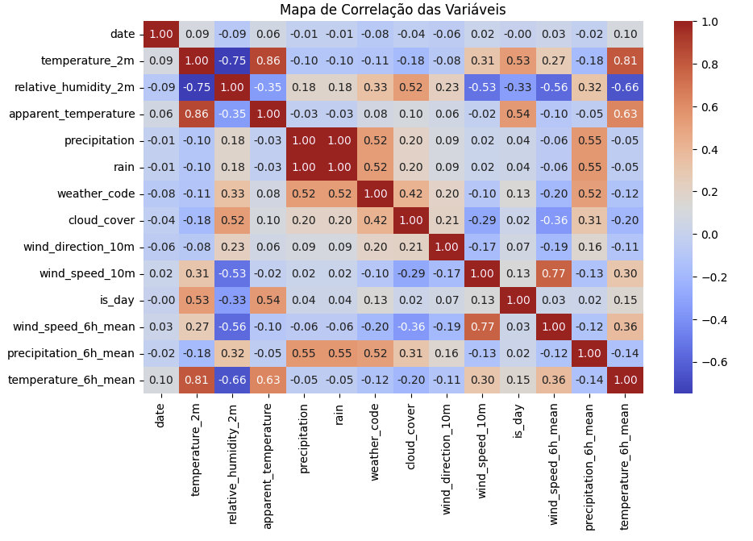
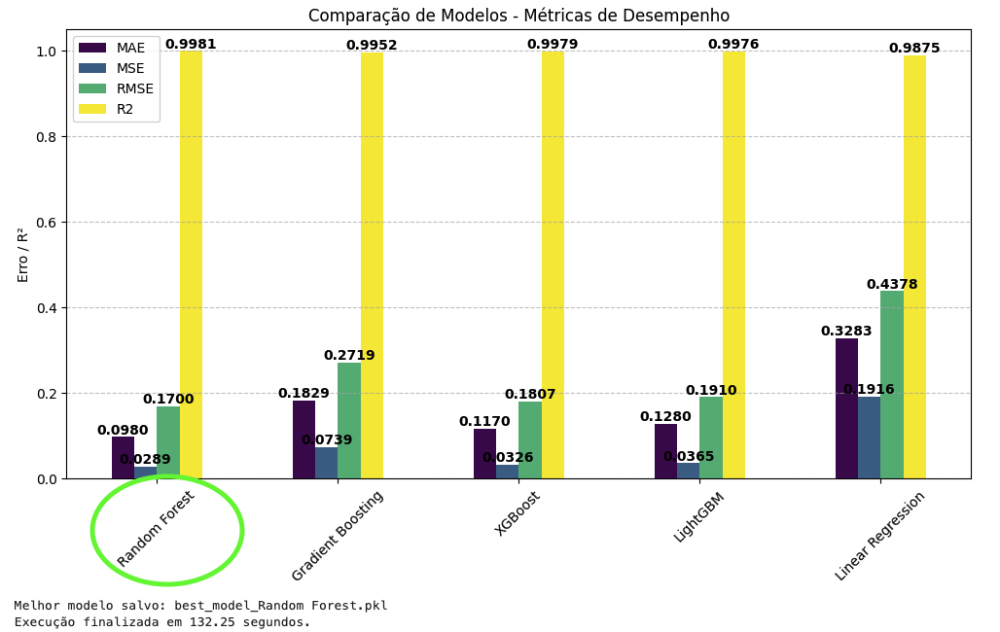

# 3º Tech Challenge - Processo de Previsão de Temperatura

Este projeto tem como objetivo desenvolver um pipeline para previsão de temperatura ambiente utilizando dados climáticos históricos e informações em tempo real capturadas a partir de uma API pública. O modelo de previsão baseia-se em variáveis como umidade relativa, precipitação, velocidade do vento e outros fatores climáticos relevantes.

## Etapas do Processo

### 1. Análise Exploratória de Dados (EDA)

A primeira etapa do projeto consistiu na coleta e análise dos dados históricos de temperatura e variáveis climáticas para identificar padrões e relações entre as features. Durante essa fase, foram realizadas:

- **Visualização de distribuições** para compreender o comportamento de cada variável.
- **Análise de correlação** entre as variáveis climáticas e a temperatura ambiente.
- **Identificação e tratamento de outliers** para garantir maior robustez ao modelo.

Abaixo, alguns exemplos das visualizações obtidas:

Os dados utilizados no treinamento abrangem o período de **janeiro de 2020 a dezembro de 2024**, totalizando **43.848 registros**.

### 2. Treinamento e Avaliação de Modelos

A segunda etapa envolveu o treinamento de modelos de regressão para prever a temperatura ambiente. Foram testados diferentes algoritmos de aprendizado de máquina, avaliando seu desempenho com base nas seguintes métricas:

- **Erro Quadrático Médio (RMSE):** Mede a diferença entre os valores previstos e reais.
- **Coeficiente de Determinação (R²):** Indica o quanto o modelo consegue explicar a variabilidade dos dados.

Abaixo, um resumo das avaliações dos modelos:

### 3. Fluxo de Dados em Tempo Real

- **Captura de Dados Climáticos:**
  Os dados são coletados a cada 15 minutos a partir da [API Pública do Open-Meteo](https://open-meteo.com/).

- **Persistência dos Dados:**
  Os dados capturados são armazenados em um banco de dados SQL para acesso e análise.

- **Predição de Temperatura:**
  O modelo treinado é utilizado para prever a temperatura ambiente com base nos dados mais recentes.

## Features Utilizadas

As seguintes variáveis foram utilizadas para treinar o modelo:

- **relative_humidity_2m**: Umidade relativa do ar a 2 metros de altura.
- **apparent_temperature**: Temperatura aparente considerando vento e umidade.
- **precipitation**: Volume de precipitação acumulado em um período.
- **rain**: Indicador binário de ocorrência de chuva.
- **weather_code**: Código que representa a condição climática.
- **cloud_cover**: Percentual de cobertura de nuvens.
- **wind_direction_10m**: Direção do vento a 10 metros de altura.
- **wind_speed_10m**: Velocidade do vento a 10 metros de altura.
- **is_day**: Indicador binário para diferenciar dia e noite.
- **wind_speed_6h_mean**: Média da velocidade do vento nas últimas 6 horas.
- **precipitation_6h_mean**: Média da precipitação acumulada nas últimas 6 horas.
- **temperature_6h_mean**: Média da temperatura medida nas últimas 6 horas.

## Ferramentas Utilizadas

- **Kestra:** Orquestração de workflows para captura, armazenamento e predição de dados climáticos.
- **Python:** Principal linguagem para processamento de dados e treinamento de modelos.
- **Bibliotecas:**
  - **Pandas:** Manipulação e análise de dados.
  - **NumPy:** Cálculos numéricos e operações com arrays.
  - **Scikit-learn:** Modelos de aprendizado de máquina.
  - **Seaborn e Matplotlib:** Visualização de dados.

## Melhorias Futuras

Para aprimorar o projeto, algumas melhorias podem ser implementadas:

1. **Monitoramento do Modelo:**
   - Avaliação contínua do desempenho do modelo em produção.
   - Detecção automática de quedas de performance.

2. **Identificação de Drift nos Dados:**
   - Monitoramento de mudanças na distribuição dos dados de entrada.
   - Implementação de alertas para necessidade de re-treinamento do modelo.

3. **Aprimoramento na Captura de Dados:**
   - Inclusão de mais fontes de dados climáticos para aumentar a robustez do modelo.
   - Melhorias na qualidade dos dados coletados.

4. **Criação de uma Feature Store com Feast:**
   - Centralização e padronização das features utilizadas pelo modelo.
   - Facilita a reutilização e a consistência dos dados para novos experimentos.

## Conclusão

Este projeto combina análise de dados históricos com dados em tempo real para previsão de temperatura ambiente. A utilização de aprendizado de máquina permitiu construir um modelo preciso, enquanto a orquestração com Kestra garantiu um fluxo eficiente e automatizado para coleta, armazenamento e previsão dos dados. Futuras melhorias visam tornar o sistema mais robusto e escalável, permitindo um monitoramento mais eficiente e a evolução contínua do modelo.
"""
